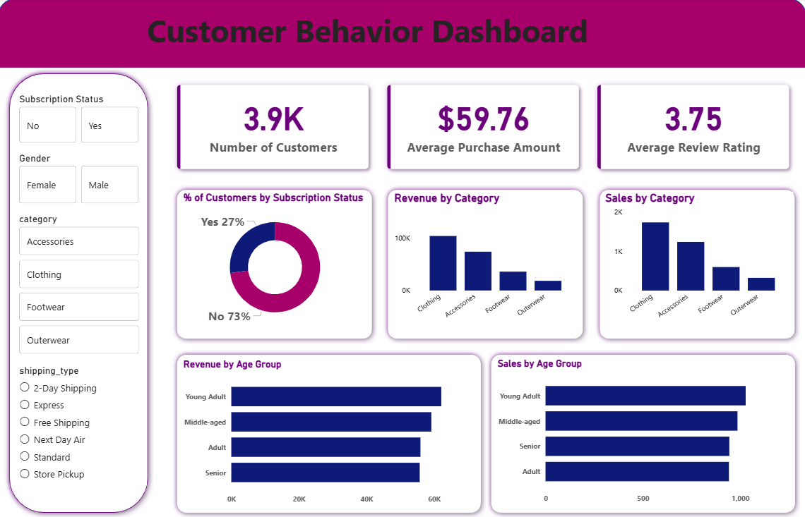

# 📊 Customer Behavior Analysis Dashboard

## 📌 Overview

This project analyzes customer purchasing behavior using **PostgreSQL, Python (Pandas), and Power BI** to derive meaningful business insights. The data is processed and transformed using SQL and Pandas, then visualized through an interactive Power BI dashboard.

---

## 🎯 Objectives

* Analyze customer purchase trends and spending patterns
* Identify revenue contribution by product categories
* Understand subscription behavior of customers
* Evaluate customer satisfaction using review ratings

---

## 🛠️ Tools & Technologies

* **PostgreSQL** – Data extraction and querying
* **Python (Pandas)** – Data cleaning and preprocessing
* **Power BI** – Dashboard creation and visualization

---

## 📂 Dataset Description

The dataset contains customer transaction data, including:

* Customer ID
* Purchase Amount
* Product Category (Clothing, Accessories, Footwear, Outerwear)
* Subscription Status (Yes/No)
* Review Rating

---

## ⚙️ Data Processing Workflow

1. **Data Extraction (PostgreSQL)**

   * Queried raw customer data using SQL
   * Filtered and structured relevant fields

2. **Data Cleaning (Pandas)**

   * Handled missing values
   * Converted data types
   * Prepared dataset for analysis

3. **Data Visualization (Power BI)**

   * Built interactive dashboard
   * Created KPIs and charts for insights

---

## 📊 Dashboard Features

### 🔹 Key Metrics (KPIs)

* Total Customers
* Average Purchase Amount
* Average Review Rating

### 🔹 Visualizations

* Revenue by Product Category
* Subscription Status Distribution
* Customer behavior insights

---

## 📸 Dashboard Preview



---

## 🔍 Key Insights

* A large portion of customers are **non-subscribers**, indicating potential for conversion
* **Clothing category** generates the highest revenue
* Average rating (~3.7) suggests scope for improving customer satisfaction
* Customer spending varies significantly across product categories

---

## 📁 Project Structure

```
📦 customer_behavior_analysis
 ┣ 📄 Customer_Behavior_Dashboard.pbix
 ┣ 📄 customer_shopping_behavior.csv
 ┣ 📄 dashboard.png
 ┗ 📄 README.md
```

---

## 🚀 How to Run

1. Clone the repository
2. Load dataset into PostgreSQL (if required)
3. Run SQL queries for data extraction
4. Use Python (Pandas) for preprocessing
5. Open `.pbix` file in Power BI Desktop

---

## 💡 Future Improvements

* Add time-series analysis (monthly trends)
* Implement customer segmentation
* Build predictive models using machine learning
* Automate data pipeline

---

## 🙌 Conclusion

This project demonstrates how combining SQL, Python, and Power BI can provide valuable insights into customer behavior and support data-driven decision-making.

---
